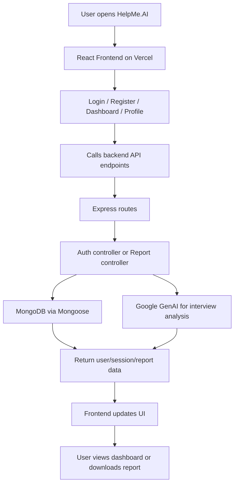

# HelpMe.AI

HelpMe.AI is a full-stack interview preparation and AI report generation app.
It combines a React/Vite frontend with an Express/MongoDB backend and supports combined deployment on Vercel.

## What it does

- User registration and login
- JWT-based session handling
- Google/LinkedIn-style OAuth simulation flows
- AI-powered interview report generation
- Profile management
- Dashboard for viewing generated reports

## Tech stack

- **Frontend:** React, Vite, React Router, Axios, Sass
- **Backend:** Node.js, Express, MongoDB, Mongoose, JWT, CORS, Cookie Parser
- **AI:** Google GenAI SDK
- **Deployment:** Vercel

## Working flow



## Request flow details

### Authentication flow

1. User submits login or registration form in the frontend.
2. Frontend sends the request to the backend API.
3. Backend validates the request, creates a JWT, and stores it in an HTTP-only cookie.
4. Frontend uses the session cookie for protected pages like profile and dashboard.

### Report generation flow

1. User enters job description, resume text, and self-description.
2. Frontend calls the report generation endpoint.
3. Backend sends the prompt to the AI service.
4. AI returns structured interview feedback.
5. Backend stores the report in MongoDB and returns it to the frontend.

## Repository structure

```text
Backend/
  src/
    config/
    controllers/
    middlewares/
    models/
    routes/
    services/
Frontend/
  src/
    features/
      auth/
      dashboard/
      home/
      profile/
api/
  [...path].js
```

## Environment variables

### Backend environment

- `MONGO_URI` — MongoDB connection string
- `JWT_SECRET` — JWT signing secret
- `GOOGLE_API_KEY` or `GEMINI_API_KEY` — AI service key
- `FRONTEND_URL` or `FRONTEND_URLS` — allowed frontend origin(s)

### Frontend environment

- `VITE_API_URL` — backend base URL for local development or external deployments

## Local development

### Backend setup

- Install dependencies inside `Backend`
- Run the backend dev server from `Backend`

### Frontend setup

- Install dependencies inside `Frontend`
- Run the frontend dev server from `Frontend`

## Combined Vercel deployment

The repository is configured for a single combined Vercel setup:

- Frontend is built from `Frontend`
- Backend is exposed through the root `api/[...path].js` route
- React Router paths are rewritten to `index.html`

## Notes

- The backend uses secure cookie settings in production.
- The frontend uses the same origin in production when `VITE_API_URL` is not set.
- Keep `.env` files out of git.
